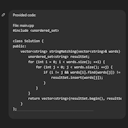

# Quick LLM Copy



Simple VSCode extension that allows you to copy code files with their relative paths in a format suitable for LLM conversations.

## Features

- Adds "Quick LLM Copy" option to the context menu in file explorer
- Adds "Quick LLM Copy (with Codebase)" option to include the project directory structure
- Adds a Quick LLM Copy (files) button in Source Control (Git) to copy whole files with current changes
- Adds a Quick LLM Copy (diff) button in Source Control (Git) to copy only Git diffs
- Supports copying multiple files at once
- Supports recursive copying of directories and their contents
- Includes relative file paths in the copied text
- Formats the output in a way that's easy to paste into LLM conversations

## Usage

1. Right-click on a file, directory, or select multiple files/directories in the VSCode explorer
2. Choose one of the following options:
   - **Quick LLM Copy**: Copies only the selected files/directories
   - **Quick LLM Copy (with Codebase)**: Copies the selected files/directories and includes the project directory structure

### Standard Copy Format

```
Provided code:

File: path/to/file1
```
// file1 contents
```

File: path/to/file2
```
// file2 contents
```
```

### Copy with Codebase Format

```
Provided code:

File: path/to/file1
```
// file1 contents
```

File: path/to/file2
```
// file2 contents
```

Codebase structure. You can ask for other files if needed:

```
Project structure:
├── src/
│   ├── components/
│   │   ├── Button.tsx
│   │   └── Input.tsx
│   └── utils/
│       └── helpers.ts
└── package.json
```
```

### Copy SCM Changes

- Open the Source Control view
- Click the Quick LLM Copy button in the view title bar (copy icon)
- This copies all current Git changes (staged, unstaged, and untracked files that exist on disk) using the same format as the Standard Copy

### Copy SCM Diff

- Open the Source Control view
- Click the Quick LLM Copy (SCM Diff) button in the view title bar (diff icon)
- This copies a unified Git diff (patch) for all current changes:
  - Includes staged, unstaged, and untracked files (untracked shown as diffs from /dev/null)
  - Skips deleted files' contents (diff will show deletions)

Example output:

```
Provided code:

Repository: your-repo
diff --git a/src/example.ts b/src/example.ts
index abcdef0..1234567 100644
--- a/src/example.ts
+++ b/src/example.ts
@@ -1,2 +1,3 @@
 export const a = 1;
 export const b = 2;
+export const c = 3;
```

## Requirements

- Visual Studio Code version 1.60.0 or higher

## Extension Settings

This extension contributes the following settings:

* `quickLLMCopy.prefixText`: The text that appears before the copied code content (default: "Provided code:")
* `quickLLMCopy.codebaseText`: The text that appears before the codebase structure (default: "You can ask for other files from the codebase if needed:")

## Known Issues

None at the moment.

## Future Plans

- Add support for custom output formats
- Add the ability to shorten code by removing comments or anything else
- Add support for filtering files by extension
- Improve handling of large files

## Release Notes

See CHANGELOG.md for detailed release notes.
